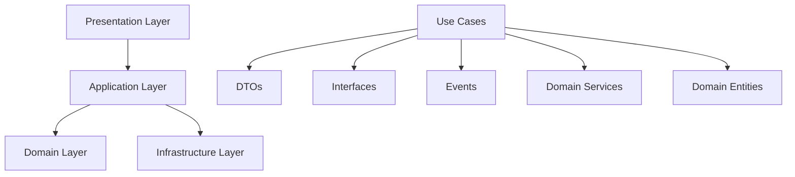

# Application Layer - Chat Orchestrator

## 🎯 **Overview**

Application Layer là tầng trung gian giữa **Presentation Layer** và **Domain Layer**, chịu trách nhiệm orchestrate các business operations và coordinate giữa các external services.

## 🏗️ **Architecture**

```
📁 app/application/
├── 📁 use_cases/          # Application Services (Use Cases)
├── 📁 dtos/              # Data Transfer Objects
├── 📁 interfaces/        # External Service Contracts
├── 📁 events/           # Application Events
└── exceptions.py        # Application Exceptions
```

### **🔄 Layer Interaction Flow**



## 📝 **Components**

### **1. Use Cases (Application Services)**

#### **BotUseCases**
```python
class BotUseCases:
    async def create_bot(self, create_dto: CreateBotDTO) -> BotDTO
    async def update_bot(self, bot_id: UUID, update_dto: UpdateBotDTO) -> BotDTO
    async def perform_bot_operation(self, operation_dto: BotOperationDTO) -> BotDTO
    async def search_bots(self, search_dto: BotSearchDTO) -> BotListDTO
    async def get_bot_statistics(self, bot_id: UUID) -> BotStatsDTO
    async def delete_bot(self, bot_id: UUID) -> bool
```

#### **ConversationUseCases**
```python
class ConversationUseCases:
    async def start_conversation(self, start_dto: StartConversationDTO) -> Tuple[ConversationDTO, MessageDTO]
    async def process_user_message(self, process_dto: ProcessMessageDTO) -> Tuple[ConversationDTO, MessageDTO, MessageDTO]
    async def escalate_conversation(self, escalate_dto: EscalateConversationDTO) -> ConversationDTO
    async def transfer_conversation(self, transfer_dto: TransferConversationDTO) -> ConversationDTO
    async def end_conversation(self, end_dto: EndConversationDTO) -> ConversationDTO
```

#### **MessageUseCases**
```python
class MessageUseCases:
    async def create_message(self, create_dto: CreateMessageDTO) -> MessageDTO
    async def process_message_for_ai(self, process_dto: ProcessMessageDTO) -> MessageDTO
    async def retry_failed_message(self, retry_dto: RetryMessageDTO) -> MessageDTO
    async def search_messages(self, search_dto: MessageSearchDTO) -> MessageListDTO
    async def perform_bulk_operation(self, bulk_dto: BulkMessageOperationDTO) -> Dict[str, Any]
```

### **2. Data Transfer Objects (DTOs)**

#### **Bot DTOs**
- `CreateBotDTO` - Bot creation data
- `UpdateBotDTO` - Bot update data
- `BotDTO` - Complete bot information
- `BotListDTO` - Paginated bot list
- `BotStatsDTO` - Bot statistics
- `BotOperationDTO` - Bot operations (activate/deactivate)
- `BotSearchDTO` - Bot search filters

#### **Conversation DTOs**
- `StartConversationDTO` - Conversation start data
- `ProcessMessageDTO` - Message processing data
- `ConversationDTO` - Complete conversation information
- `EscalateConversationDTO` - Escalation data
- `TransferConversationDTO` - Transfer data
- `UpdateContextDTO` - Context update data

#### **Message DTOs**
- `CreateMessageDTO` - Message creation data
- `MessageDTO` - Complete message information
- `MessageListDTO` - Paginated message list
- `ProcessMessageDTO` - AI processing data
- `RetryMessageDTO` - Retry data
- `BulkMessageOperationDTO` - Bulk operations

### **3. External Service Interfaces**

#### **IAIService**
```python
class IAIService(ABC):
    async def generate_response(self, request: AIRequest) -> AIResponse
    async def analyze_sentiment(self, text: str) -> Dict[str, Any]
    async def extract_intent(self, text: str, context: Dict[str, Any]) -> Dict[str, Any]
    async def extract_entities(self, text: str) -> List[Dict[str, Any]]
    async def summarize_conversation(self, messages: List[str]) -> str
```

#### **IPlatformService**
```python
class IPlatformService(ABC):
    async def send_message(self, request: SendMessageRequest) -> SendMessageResponse
    async def get_user_info(self, external_user_id: str) -> PlatformUser
    async def set_webhook(self, webhook_url: str) -> bool
    async def upload_media(self, file_path: str, media_type: str) -> Dict[str, Any]
```

#### **INotificationService**
```python
class INotificationService(ABC):
    async def send_notification(self, request: NotificationRequest) -> NotificationResponse
    async def send_bulk_notifications(self, requests: List[NotificationRequest]) -> List[NotificationResponse]
    async def schedule_notification(self, request: NotificationRequest, send_at: str) -> NotificationResponse
```

### **4. Application Events**

#### **Conversation Events**
- `ConversationStartedEvent` - Conversation initiated
- `ConversationEndedEvent` - Conversation completed
- `ConversationEscalatedEvent` - Escalation triggered
- `ConversationTransferredEvent` - Bot transfer
- `ConversationTimeoutEvent` - Timeout occurred
- `ConversationHealthCheckEvent` - Health monitoring

#### **Message Events**
- `MessageCreatedEvent` - Message created
- `MessageProcessedEvent` - Processing completed
- `MessageFailedEvent` - Processing failed
- `MessageRetriedEvent` - Retry attempted
- `MessageSentEvent` - Sent to platform
- `MessageAnalyzedEvent` - Analysis completed

### **5. Application Exceptions**

```python
class ApplicationError(Exception)
class UseCaseError(ApplicationError)
class ValidationError(ApplicationError)
class ExternalServiceError(ApplicationError)
class ResourceNotFoundError(ApplicationError)
class ConcurrencyError(ApplicationError)
class AuthorizationError(ApplicationError)
class RateLimitError(ApplicationError)
class ConfigurationError(ApplicationError)
```

## 🚀 **Usage Examples**

### **1. Starting a Conversation**

```python
# Use Case
conversation_use_cases = ConversationUseCases(
    conversation_repository=conversation_repo,
    bot_repository=bot_repo,
    ai_service=ai_service,
    platform_service=telegram_service
)

# Create DTO
start_dto = StartConversationDTO(
    bot_id=UUID("..."),
    initial_message="Hello, I need help",
    external_user_id="telegram_123",
    platform="telegram",
    external_user_data={"username": "john_doe"}
)

# Execute
conversation, initial_message = await conversation_use_cases.start_conversation(start_dto)
```

### **2. Processing User Message**

```python
# Create DTO
process_dto = ProcessMessageDTO(
    conversation_id="conv_123",
    message_content="I want to cancel my order",
    external_user_id="telegram_123",
    metadata={"message_id": "msg_456"}
)

# Execute with AI response
conversation, user_msg, bot_response = await conversation_use_cases.process_user_message(process_dto)
```

### **3. Bot Management**

```python
# Create bot
create_dto = CreateBotDTO(
    name="Customer Service Bot",
    description="Handles customer inquiries",
    bot_type=BotTypeDTO.CUSTOMER_SERVICE,
    language="en",
    core_ai_id=UUID("..."),
    platform_id=UUID("..."),
    config=BotConfigDTO(
        ai_provider="openai",
        ai_model="gpt-3.5-turbo",
        ai_temperature=0.7,
        ai_max_tokens=1000,
        platform_type="telegram",
        max_concurrent_users=100,
        max_conversation_length=50
    )
)

bot = await bot_use_cases.create_bot(create_dto)
```

### **4. Message Processing with AI**

```python
# Process message for AI
process_dto = ProcessMessageDTO(
    message_id=UUID("..."),
    ai_provider="openai",
    ai_model="gpt-3.5-turbo",
    context_data={"user_history": [...], "intent": "cancel_order"},
    temperature=0.7,
    max_tokens=500
)

processed_message = await message_use_cases.process_message_for_ai(process_dto)
```

## 🔄 **Event-Driven Architecture**

### **Event Publishing Pattern**

```python
# In Use Cases
async def start_conversation(self, start_dto: StartConversationDTO):
    # Business logic
    conversation, message = self.orchestrator.start_conversation(...)

    # Publish event
    event = ConversationStartedEvent.create(
        conversation_id=conversation.conversation_id,
        bot_id=conversation.bot_id,
        external_user_id=start_dto.external_user_id,
        platform=start_dto.platform,
        initial_message=start_dto.initial_message,
        user_data=start_dto.external_user_data
    )

    await self.event_publisher.publish(event)

    return conversation, message
```

### **Event Handlers**

```python
@event_handler(ConversationStartedEvent)
async def handle_conversation_started(event: ConversationStartedEvent):
    # Analytics tracking
    await analytics_service.track_conversation_start(event)

    # Notification
    await notification_service.notify_admins(
        subject="New Conversation Started",
        content=f"User {event.external_user_id} started conversation"
    )

@event_handler(MessageFailedEvent)
async def handle_message_failed(event: MessageFailedEvent):
    # Auto-retry logic
    if event.can_retry and event.retry_count < 3:
        await message_use_cases.retry_failed_message(
            RetryMessageDTO(
                message_id=event.message_id,
                retry_reason="Auto-retry after failure",
                max_retries=3
            )
        )
```

## 🛡️ **Error Handling**

### **Structured Error Handling**

```python
async def process_user_message(self, process_dto: ProcessMessageDTO):
    try:
        # Domain operations
        conversation = await self.conversation_repository.get_by_external_id(...)

        # External service calls
        ai_response = await self.ai_service.generate_response(...)

        return result

    except BusinessRuleViolationError as e:
        # Domain business rule violations
        logger.error("Business rule violation", error=str(e))
        raise UseCaseError("process_user_message", str(e), e.error_code)

    except ExternalServiceError as e:
        # External service failures
        logger.error("External service error", service=e.service, error=str(e))

        # Publish failure event
        await self._publish_message_failed_event(...)

        raise UseCaseError("process_user_message", f"Service unavailable: {e.service}")

    except Exception as e:
        # Unexpected errors
        logger.error("Unexpected error", error=str(e))
        raise UseCaseError("process_user_message", f"Internal error: {str(e)}")
```

## ⚡ **Performance Considerations**

### **1. DTO Validation**
- Built-in validation in `__post_init__` methods
- Early validation prevents downstream errors
- Clear error messages for debugging

### **2. Async Operations**
- All Use Cases are async for non-blocking I/O
- Parallel external service calls where possible
- Proper timeout handling

### **3. Event Processing**
- Asynchronous event publishing
- Event batching for high throughput
- Retry mechanisms for event delivery

### **4. Resource Management**
- Connection pooling for external services
- Caching of frequently accessed data
- Rate limiting for external API calls

## 🧪 **Testing Strategy**

### **1. Unit Testing Use Cases**

```python
@pytest.fixture
def mock_repositories():
    return {
        'bot_repository': Mock(spec=IBotRepository),
        'conversation_repository': Mock(spec=IConversationRepository)
    }

@pytest.fixture
def mock_services():
    return {
        'ai_service': Mock(spec=IAIService),
        'platform_service': Mock(spec=IPlatformService)
    }

async def test_create_bot_success(mock_repositories, mock_services):
    # Arrange
    use_cases = BotUseCases(mock_repositories['bot_repository'])
    create_dto = CreateBotDTO(...)

    mock_repositories['bot_repository'].create.return_value = mock_bot

    # Act
    result = await use_cases.create_bot(create_dto)

    # Assert
    assert isinstance(result, BotDTO)
    mock_repositories['bot_repository'].create.assert_called_once()
```

### **2. Integration Testing**

```python
async def test_conversation_flow_integration():
    # Test complete conversation flow
    # 1. Start conversation
    # 2. Process user message
    # 3. Generate AI response
    # 4. Send to platform
    # 5. Verify events published
    pass
```

## 📊 **Monitoring & Observability**

### **1. Structured Logging**

```python
logger.info("Processing user message",
           conversation_id=process_dto.conversation_id,
           external_user_id=process_dto.external_user_id,
           message_length=len(process_dto.message_content))
```

### **2. Metrics Collection**

- Use Case execution times
- Success/failure rates
- External service response times
- Event processing metrics

### **3. Health Checks**

```python
async def health_check():
    checks = {
        'ai_service': await ai_service.health_check(),
        'platform_service': await platform_service.health_check(),
        'notification_service': await notification_service.health_check()
    }
    return all(checks.values())
```

## 🔄 **Migration & Deployment**

### **1. Backward Compatibility**
- DTO versioning for API compatibility
- Event schema evolution
- Graceful degradation for service failures

### **2. Feature Flags**
- Enable/disable new features
- A/B testing support
- Gradual rollout capabilities

### **3. Configuration Management**
- Environment-specific configurations
- Hot reloading of non-critical settings
- Secure secret management

---

**Application Layer hoàn thành! 🎉**

Đây là tầng quan trọng nhất trong Clean Architecture, chịu trách nhiệm orchestrate toàn bộ business workflows và đảm bảo tính nhất quán của hệ thống.