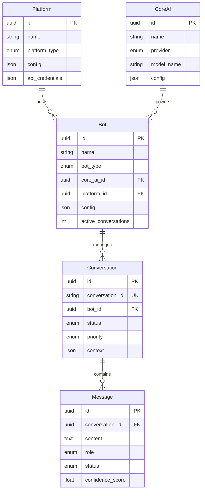

# Infrastructure Layer - Chat Orchestrator

## 🎯 **Overview**

Infrastructure Layer provides concrete implementations of all external dependencies and technical concerns, implementing the interfaces defined in the Application Layer.

## 🏗️ **Architecture**

```
📁 app/infrastructure/
├── 📁 database/           # Database infrastructure
│   ├── connection.py      # Database connection management
│   ├── session.py         # Async session management
│   └── models.py          # SQLAlchemy models
├── 📁 repositories/       # Repository implementations
│   ├── bot_repository.py  # SQLAlchemy Bot Repository
│   └── conversation_repository.py  # SQLAlchemy Conversation Repository
├── 📁 services/          # External service implementations
│   ├── openai_service.py  # OpenAI API integration
│   ├── telegram_service.py  # Telegram Bot API
│   └── email_notification_service.py  # Email notifications
├── 📁 cache/             # Caching implementations
├── 📁 events/            # Event publishing infrastructure
└── 📁 config/            # Configuration management
```

## 📝 **Components Implemented**

### **1. Database Infrastructure**

#### **Connection Management**
- **Environment-based configuration** with fallbacks
- **Connection pooling** with optimized settings
- **Async PostgreSQL** support with asyncpg
- **Health checks** and monitoring

#### **Session Management**
- **Async session factory** with proper lifecycle
- **Context managers** for automatic transaction handling
- **Error handling** with rollback support
- **Connection cleanup** on shutdown

#### **SQLAlchemy Models**
- **Complete entity models**: Bot, Conversation, Message, Platform, CoreAI
- **Proper relationships** with lazy loading options
- **Database indexes** for query optimization
- **Validation constraints** and data integrity
- **Enum support** for type safety

### **2. Repository Implementations**

#### **SqlAlchemyBotRepository**
- **Full CRUD operations** with async support
- **Advanced search** with filters and pagination
- **Statistics aggregation** with performance metrics
- **Soft delete** implementation
- **Domain/Model conversion** with proper mapping

### **3. External Service Implementations**

#### **OpenAIService (AI Service)**
- **Chat completions** with context awareness
- **Sentiment analysis** using AI models
- **Intent extraction** with confidence scoring
- **Entity extraction** from user messages
- **Conversation summarization**
- **Language detection** and translation
- **Content safety** moderation
- **Model management** and health checks

#### **TelegramService (Platform Service)**
- **Message sending** with formatting support
- **Webhook management** for real-time updates
- **User information** retrieval
- **Media handling** (upload/download)
- **Chat management** operations
- **Rate limiting** compliance

#### **EmailNotificationService**
- **Email sending** with templates
- **Bulk notifications** support
- **Scheduling** capabilities
- **Template management**
- **Delivery tracking**

## 🚀 **Key Features**

### **1. Performance Optimizations**
```python
# Connection pooling
engine = create_engine(
    database_url,
    pool_size=10,
    max_overflow=20,
    pool_timeout=30,
    pool_recycle=3600
)

# Async operations
async with get_db_session() as db:
    result = await db.execute(query)
```

### **2. Error Handling**
```python
try:
    # Database operation
    await db.session.commit()
except Exception as e:
    await db.session.rollback()
    logger.error("Transaction failed", error=str(e))
    raise RepositoryError(f"Failed: {str(e)}")
```

### **3. Health Monitoring**
```python
async def check_database_health() -> bool:
    try:
        async with get_db_session() as db:
            await db.execute("SELECT 1")
            return True
    except Exception:
        return False
```

## 📊 **Database Schema**

### **Entity Relationships**


### **Indexes for Performance**
```sql
-- Bot indexes
CREATE INDEX idx_bots_type ON bots(bot_type);
CREATE INDEX idx_bots_platform ON bots(platform_id);
CREATE INDEX idx_bots_active ON bots(is_active);

-- Conversation indexes
CREATE INDEX idx_conversations_bot ON conversations(bot_id);
CREATE INDEX idx_conversations_status ON conversations(status);
CREATE INDEX idx_conversations_external_id ON conversations(conversation_id);

-- Message indexes
CREATE INDEX idx_messages_conversation ON messages(conversation_id);
CREATE INDEX idx_messages_role ON messages(role);
CREATE INDEX idx_messages_created_at ON messages(created_at);
```

## 🔧 **Configuration Management**

### **Environment Variables**
```bash
# Database
DB_HOST=localhost
DB_PORT=5432
DB_NAME=chat_orchestrator
DB_USER=postgres
DB_PASSWORD=postgres

# External Services
OPENAI_API_KEY=sk-...
TELEGRAM_BOT_TOKEN=...
EMAIL_SERVICE_API_KEY=...

# Application
DEBUG=true
LOG_LEVEL=INFO
```

### **Service Configuration**
```python
# OpenAI Service
openai_service = OpenAIService(
    api_key=os.getenv("OPENAI_API_KEY"),
    timeout=30
)

# Database
await init_database()
```

## 🧪 **Testing Strategy**

### **1. Repository Testing**
```python
@pytest.mark.asyncio
async def test_bot_repository_create():
    # Arrange
    bot = create_test_bot()

    # Act
    created_bot = await bot_repository.create(bot)

    # Assert
    assert created_bot.id is not None
    assert created_bot.name == bot.name
```

### **2. Service Integration Testing**
```python
@pytest.mark.asyncio
async def test_openai_service_generate_response():
    # Arrange
    service = OpenAIService(api_key="test-key")
    request = AIRequest(
        message="Hello",
        context={},
        model="gpt-3.5-turbo"
    )

    # Act
    response = await service.generate_response(request)

    # Assert
    assert response.content is not None
    assert 0 <= response.confidence_score <= 1
```

## 📈 **Monitoring & Observability**

### **1. Database Monitoring**
- Connection pool statistics
- Query performance metrics
- Transaction success/failure rates
- Active connection counts

### **2. External Service Monitoring**
- API response times
- Success/failure rates
- Rate limit compliance
- Token usage tracking

### **3. Health Checks**
```python
async def health_check():
    checks = {
        'database': await check_database_health(),
        'openai': await openai_service.health_check(),
        'telegram': await telegram_service.health_check()
    }
    return all(checks.values())
```

## 🚀 **Deployment Considerations**

### **1. Database Migrations**
```bash
# Generate migration
alembic revision --autogenerate -m "Add bot table"

# Apply migrations
alembic upgrade head
```

### **2. Environment Setup**
```dockerfile
# Database service
services:
  postgres:
    image: postgres:15
    environment:
      POSTGRES_DB: chat_orchestrator
      POSTGRES_USER: postgres
      POSTGRES_PASSWORD: postgres
```

### **3. Scaling Considerations**
- **Read replicas** for query performance
- **Connection pooling** configuration
- **Cache layers** for frequently accessed data
- **External service rate limiting**

---

**Infrastructure Layer provides the solid foundation for the entire Chat Orchestrator system! 🏗️**